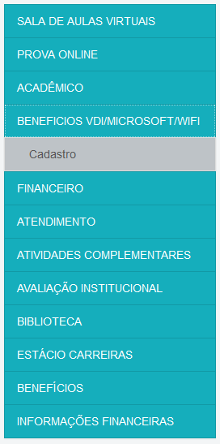

# Guias

Aqui você encontrará alguns guias práticos.

---

## Resetar Senha do SIA

---

## Criação de Teams/Office/Email de aluno

### O que eu preciso para entrar no Teams/Baixar o Office?

Você precisa criar seu email de aluno dentro do SIA.

Seu email de aluno é _`suamatricula`_`@alunos.estacio.br` onde _`suamatricula`_ é o número da sua matrícula.

### Como criar meu email de aluno?

1. Comece entrando no seu SIA, [clicando aqui](https://sia.estacio.br/sianet/logon)

2. Dentro do seu SIA vá na opção `Beneficios VDI/Microsoft/Wifi` e depois em **Cadastro**.
(não confundir com a opção 'Benefícios' mais embaixo.)

    

       
    

3. Insira uma senha que contenha todos os requisitos.

    

     
    

4. As cores indicam o que falta colocar na sua senha, exemplos de caracteres especiais são `! @ # $ % & *`, após inserir a senha aceite os 'Termos de Uso' e clique em confirmar. (caso o botão confirmar não possa ser clicado ou esteja cinza verifique se tem algo de errado ou faltando na senha.)

    

     
    

5. Após clicar deve aparecer essa mensagem, aguarde 10 minutos para que a senha seja atualizada nos servidores.

    

     
    

6. Agora vamos verificar esse email, entre em [portal.office.com](https://portal.office.com)

    

     
    

7. Insira o seu email de aluno (que é _`suamatricula`_`@alunos.estacio.br` onde _`suamatricula`_ é o número da sua matrícula.) e clique em **Avançar**

    

     
    

8. Insira a senha que você acabou de criar no seu SIA e clique em **Entrar**

    

     
    

9. Caso seja seu primeiro acesso irá aparecer essa tela, clique em Avançar.

    

     
    

10. Logo após será necessário cadastrar um número de celular e/ou um email para recuperação de senha, siga as instruções na tela para confirmar esse email/celular. (use seu email pessoal)

    

     
    

11. Após o cadastro e confirmação aparecerá essa tela.

    

     
    

12. Nessa mesma página você já pode acessar a versão Web do Teams clicando no ícone dele, [ou clicando aqui](https://aka.ms/mstfw) (Recomendo baixar o [aplicativo por aqui](https://www.microsoft.com/pt-br/microsoft-365/microsoft-teams/download-app), tem tanto para computador quanto para celular.)

    

     
    

13. Você pode também instalar o Office no seu computador clicando na opção ´Instalar o Office´ nessa página.

    

     
    

